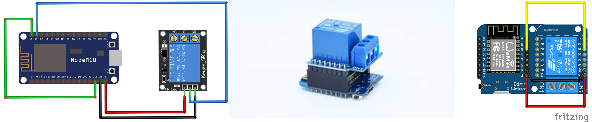

# MQTT Relay:




## HOME ASSISTANT integration

If headerTopic is changed
```
"{headertopic}/setPower"
"{headertopic}/powerSet" 
```
i.e. headerTopic = "downstairs/livingroom/sofalight/" your power topics will be:
```
downstairs/livingroom/sofalight/setPower
downstairs/livingroom/sofalight/powerSet
```
If the relay controls a socket or a generic load
```
switch:
  platform: mqtt
  name: "my first controlled relay"
  command_topic: "myESP/setPower" 
  state_topic: "myESP/powerSet" 
  payload_on: "ON"
  payload_off: "OFF"
  optimistic: false
  qos: 1
  retain: true
```
If the relay controls a light then:
```
light:
  platform: mqtt
  name: "my first controlled relay"
  command_topic: "myESP/setPower" 
  state_topic: "myESP/powerSet" 
  payload_on: "ON"
  payload_off: "OFF"
  optimistic: false
  qos: 1
  retain: true
  ```
  ## NODE RED integration
  The following nodes create a switch able to control the relay with NODE_RED dashboard
  
  
  
        [{"id":"6fdb6903.a74018","type":"mqtt out","z":"fc881a4.c3923e8","name":"command topic","topic":"","qos":"","retain":"","broker":"","x":680,"y":1121,"wires":[]},{"id":"b3124e99.1265b","type":"mqtt in","z":"fc881a4.c3923e8","name":"state topic","topic":"myESP/powerSet","qos":"1","broker":"","x":292,"y":1122,"wires":[["d060f711.d8ac58"]]},{"id":"d060f711.d8ac58","type":"ui_switch","z":"fc881a4.c3923e8","name":"","label":"MQTT RELAY","group":"5f9dbe9c.19899","order":0,"width":0,"height":0,"passthru":true,"decouple":"false","topic":"","style":"","onvalue":"ON","onvalueType":"str","onicon":"","oncolor":"","offvalue":"OFF","offvalueType":"str","officon":"","offcolor":"","x":473.8299102783203,"y":1121.5555725097656,"wires":[["6fdb6903.a74018"]]},{"id":"5f9dbe9c.19899","type":"ui_group","z":"","name":"Default","tab":"","disp":true,"width":"6"}]
